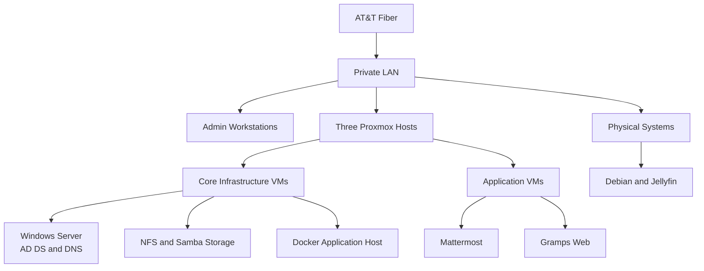

# ESSM HomeLab Infrastructure

This sanitized diagram presents the major infrastructure roles without exposing exact addresses, credentials, or sensitive configuration.

## Major Infrastructure Functions

| Area | Technology |
|---|---|
| Virtualization | Proxmox VE |
| Identity | Windows Server Active Directory |
| Name resolution | Microsoft DNS |
| Applications | Docker and Docker Compose |
| Storage | NFS and Samba |
| Administration | SSH, Bash, PowerShell, and WSL |
| Monitoring | Custom ESSM health and port checks |

The public diagram emphasizes architecture and skills while intentionally omitting implementation details that are unnecessary for an employment portfolio.
