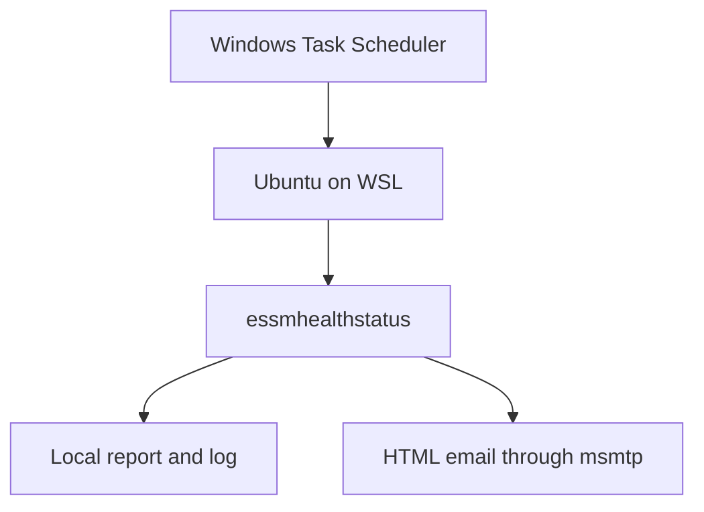

# Automated ESSM Health Reporting

## Project summary

This project turns the interactive `essmhealthstatus` command into a scheduled daily operations report. A Windows administrative workstation starts Ubuntu under Windows Subsystem for Linux (WSL), runs the cross-platform health checks, saves the report locally, and delivers a formatted HTML email.

The public example is intentionally sanitized. Email addresses, credentials, private keys, exact private inventory, and generated reports are excluded.

## Objectives

- Run the consolidated infrastructure report every day at 7:00 AM local time
- Start WSL automatically when the report is due
- Retain a timestamped plain-text report for operational history
- Send an HTML email with a readable fixed-width report body
- Mark the message `ATTENTION` when a host is offline, unhealthy, degraded, or requires a reboot
- Retry transient task failures and run missed tasks when the workstation becomes available
- Keep SMTP credentials outside the repository

## Architecture



## Components

| Component | Responsibility |
|---|---|
| Windows Task Scheduler | Starts WSL daily, retries failures, and runs a missed task when possible |
| WSL Ubuntu | Provides the Bash, SSH, reporting, and mail environment |
| `essmstatus` | Performs rapid network-availability checks |
| `essmhealth` | Collects platform, uptime, health, and pending-reboot information |
| `essmhealthstatus` | Combines availability and detailed health into one report |
| `essm-daily-email.sh` | Saves, evaluates, formats, emails, and logs each report |
| `msmtp` | Sends mail through an authenticated TLS connection |

## Report behavior

The wrapper script loads the existing ESSM functions and writes a timestamped report under `$HOME/.essm/reports/`. It uses a nonblocking file lock to prevent overlapping executions and records delivery results under `$HOME/.essm/logs/`.

The email contains both plain-text and HTML MIME alternatives. The HTML view includes a status summary and displays the complete report in a fixed-width console panel so columns remain aligned in modern mail clients.

The subject is classified as follows:

| Status | Condition |
|---|---|
| `OK` | Report completed without matching an attention condition |
| `ATTENTION` | Script failure, offline/unhealthy/degraded state, or a pending reboot |

## Sanitized script

The reusable portfolio version is available at [`scripts/essm-daily-email.sh`](../scripts/essm-daily-email.sh). Configure sender and recipient values using environment variables rather than editing credentials into the script:

```bash
export ESSM_MAIL_FROM="sender@example.com"
export ESSM_MAIL_TO="recipient@example.com,second@example.com"
```

SMTP authentication is supplied separately through the local `msmtp` configuration. The credential file must never be committed.

## Windows scheduled task

The implementation uses a daily Windows task whose action resembles:

```powershell
$Action = New-ScheduledTaskAction `
    -Execute "$env:WINDIR\System32\wsl.exe" `
    -Argument "--distribution Ubuntu --user <wsl-user> --exec /home/<wsl-user>/.essm/bin/essm-daily-email"

$Trigger = New-ScheduledTaskTrigger -Daily -At "7:00 AM"
```

Production settings enable `StartWhenAvailable`, `WakeToRun`, battery operation where appropriate, a 30-minute execution limit, and three retries at five-minute intervals.

## Verification

Validate the Bash wrapper before deployment:

```bash
bash -n scripts/essm-daily-email.sh
```

Run an end-to-end email test from WSL and confirm an exit status of zero. Then start the Windows task manually and verify:

```powershell
Get-ScheduledTaskInfo -TaskName "ESSM Daily Health Email" |
    Select-Object LastRunTime, NextRunTime, LastTaskResult
```

`LastTaskResult` should be `0`, and `NextRunTime` should show the next scheduled 7:00 AM execution.

## Security controls

- No passwords, tokens, private keys, or live reports are stored in Git
- The Gmail App Password is stored only in a local permission-restricted file
- `msmtp` reads the password through `passwordeval`
- The public script contains placeholder addresses
- SSH authentication remains key-based and local to the administration workstation
- Generated reports and logs are excluded from version control

## Operational result

This implementation demonstrates Windows and Linux integration, Bash automation, secure SMTP configuration, scheduled operations, cross-platform health monitoring, exception highlighting, logging, and production-style documentation.
